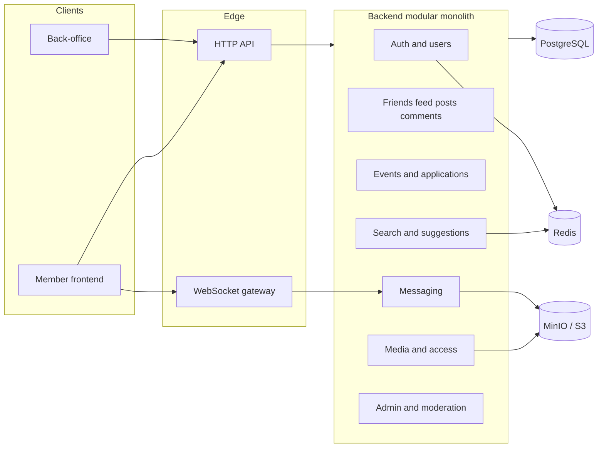

# Software architecture

| Field | Value |
| --- | --- |
| Status | Proposed |
| Related | [02-System-context.md](02-System-context.md), [07-Technology-choices.md](07-Technology-choices.md) |

Gym Buddies is a **modular monolith** behind a single API, with two web clients. That is enough to cover Software Engineering and Web Technologies without paying a microservices tax on an individual project.

## Logical view

## Why a modular monolith

| Option | Why not (for this project) |
| --- | --- |
| Many microservices | Operational cost dwarfs the academic benefit |
| Serverless-only | Harder realtime messaging and local fixtures |
| BFF per client | Two clients can share one versioned HTTP API |

Modules are **bounded contexts** in one deployable. They may not import each other’s tables; they talk through application services. That keeps a future split possible without doing it now.

## Runtime pieces

| Piece | Responsibility |
| --- | --- |
| Member frontend | Feed, profile, events, search, chat |
| Back-office | Accounts, roles, reports, fixture triggers |
| HTTP API | Commands and queries, JWT, authorization |
| WebSocket gateway | Message delivery, typing/presence (optional) |
| PostgreSQL | System of record |
| MinIO (S3 API) | Images and audio — **not** the API disk |
| Redis | Refresh-token denylist, rate limits, suggestion cache |

## Cross-cutting rules

1. Every mutating request is authenticated except `POST /auth/register` and `POST /auth/login`.
2. Every file download goes through an authorization check or a short-lived signed URL. See [../40-Technical-specifications/03-Authorization-and-file-access.md](../40-Technical-specifications/03-Authorization-and-file-access.md).
3. Clients never receive a permanent object-store key they can guess.
4. Background work (thumbnail, audio probe, suggestion recompute) is asynchronous.

## Quality attributes (targets)

| Attribute | Target |
| --- | --- |
| Auth | Access token ≤ 15 min; refresh rotated |
| Feed first page | < 300 ms p95 on fixture data (local) |
| Suggestion request | < 200 ms p95 using precomputed candidates |
| Media | No unbounded writes to the API container disk |
| Tenancy | Single deployment, role-based access |

Physical deployment can start as Docker Compose for development and a single VM or PaaS for the defense demo.
