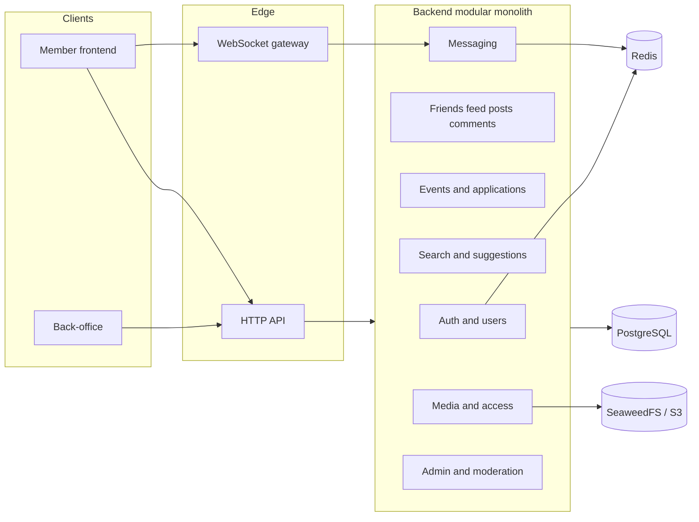

# Software architecture

Gym Buddy is a modular monolith with Angular member/staff clients and one Java HTTP/WebSocket service. This limits deployment complexity while keeping domain rules organized and testable.

## Logical view

## Responsibilities

PostgreSQL is the durable system of record. SeaweedFS stores private media objects. Redis supports refresh credentials and message publication. The application uses JDBC adapters and explicit authorization in its services.

Local Docker Compose supplies the data services. In production, GitHub Pages serves the clients and Caddy routes HTTPS traffic to the VPS application. The API is replaced independently of persistent data volumes.

A modular monolith avoids coordinating several services for an individual project. A future service split would need explicit transaction and ownership boundaries; package structure alone does not guarantee isolation.

Performance objectives such as a 300 ms feed and 200 ms suggestion response are targets requiring fixture-scale measurement. See [backend](03-Backend.md), [hosting](08-Hosting-and-GitHub-Pages.md), [technology choices](07-Technology-choices.md) and [verification](../80-Testing/06-Release-verification.md).
