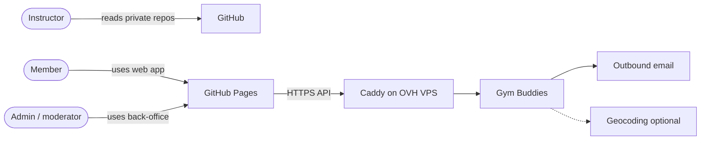

# System context

| Field | Value |
| --- | --- |
| Status | Approved |
| Related | [01-Software-architecture.md](01-Software-architecture.md), [../60-UML-diagrams/01-Use-cases.md](../60-UML-diagrams/01-Use-cases.md), [../10-Getting-started/04-Environment-and-pipeline.md](../10-Getting-started/04-Environment-and-pipeline.md) |

## System context

## Actors

| Actor | Enters through | Primary goals |
| --- | --- | --- |
| Visitor | Member frontend | Register, browse public profiles/events if allowed |
| Member | Member frontend | Feed, friends, events, chat, search |
| Moderator | Back-office (+ limited in-app tools) | Hide content, handle reports |
| Admin | Back-office | Roles, account locks, fixtures, settings |
| Instructor | GitHub / email | Evaluate the project — not a runtime actor |

## External systems

| System | Required at MVP? | Notes |
| --- | --- | --- |
| OVH VPS + Caddy | Yes for the live API | Hostname `vps-c39cdf03.vps.ovh.net`. API on loopback only. |
| SMTP / mail provider | Yes for verification; can be MailHog in dev | Do not block local fixtures on real mail |
| Object storage | Yes | MinIO locally, S3-compatible in deploy. Production refuses to start without it. |
| Geocoding | No | Members may type a free-text place + optional lat/lng |
| Push notifications | No | In-app + websocket is enough for the defense |
| GitHub Pages | Yes for static artifacts | Wiki, later Angular and OpenAPI UI |

GitHub is part of the **academic** system, not the runtime.
