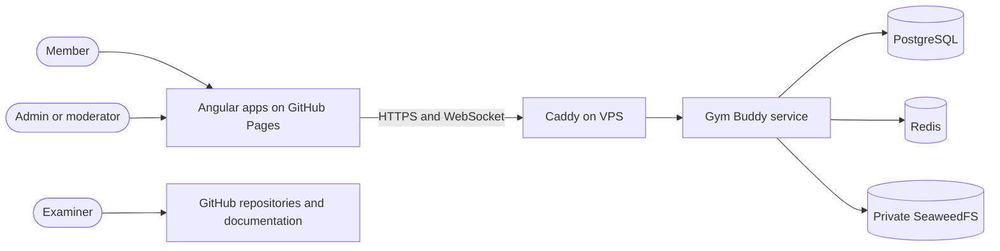

# System context

Members use social features, events and private conversations. Moderators review reports/content; administrators manage accounts, roles and fixture operations. The examiner evaluates deliverables and repository evidence, rather than participating as a runtime actor.

SeaweedFS is deployed on the VPS as well as locally. Locations are entered as text with optional coordinates; no external geocoding service is implemented. Registration does not send a verification email. GitHub is the source/build/delivery platform, not the application database.

See [architecture](01-Software-architecture.md), [hosting](08-Hosting-and-GitHub-Pages.md) and [academic deliverables](../99-Academic-deliverables/README.md).
