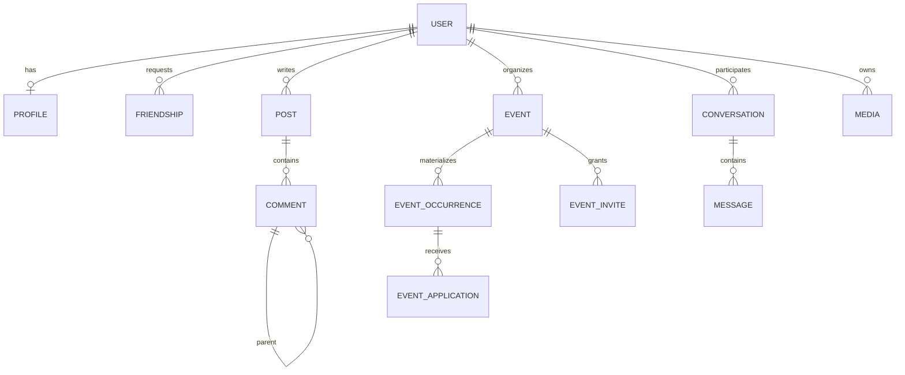

# Data model

PostgreSQL is the system of record. Service Flyway migrations define the physical schema, indexes and constraints; this page summarizes their relationships. IDs are UUIDs and timestamps use UTC.

| Tables | Persisted behavior |
| --- | --- |
| `users`, `profiles` | Unique case-insensitive `CITEXT` email, unique handle, password hash, role/status; profile display name, bio, visibility, sports array, experience, city, optional coordinates, JSONB training windows and avatar media ID. |
| `friendships` | UUID primary key; requester/addressee direction is retained. A unique `LEAST/GREATEST` pair index prevents duplicate relationships. Status is pending, accepted, declined or blocked. |
| `posts`, `post_media`, `reposts`, `likes` | Posts store body/visibility and editing/deletion/moderation timestamps. Ordered media links and unique repost/like relationships prevent duplicates. |
| `comments` | Post/author/optional parent, body and bounded denormalized depth. Deleted comments retain a tombstone for thread structure. |
| `events`, `event_occurrences` | Event details, visibility, capacity, recurrence text and optional cover. Occurrences are stored rows, unique by event/start time, with independent cancellation. |
| `event_invites`, `event_applications` | Invitations link event/user. Applications identify both event and occurrence, unique by occurrence/user, with pending/accepted/declined/cancelled/withdrawn status. |
| `conversations`, `conversation_reads`, `messages` | A direct conversation stores one ordered unique user pair (`user_lo`, `user_hi`); there is no conversation-members table. Read timestamps are per user/conversation. Messages store text/image/audio type and optional media ID. |
| `media` | Owner, purpose (`avatar`, `post`, `message`, `event`), MIME, bytes/variant bytes, `object_key`, state and deletion/moderation/cleanup timestamps. Visibility is derived from the owner and attached resource, not a media visibility column. |
| `reports`, `audit_events` | Report target/reason/status and append-only staff-action evidence. |
| `suggestion_scores`, `suggestion_dismissals` | Materialized per-user candidate scores/reasons/timestamps; dismissals expire after 30 days. Stale scores refresh synchronously on read and in the nightly job. |
| `matching_opt_ins`, `matching_pairs` | Weekly opt-ins and resulting unique user pairs linked to a generated event when present. |

Private event access uses invitations and the event service's visibility rules. Capacity counts accepted applications for the selected occurrence. Media bytes live in private S3-compatible storage; the database stores metadata and object keys. Search loads candidates into Java and does not use a PostgreSQL full-text index.

Foreign keys, unique pair/attachment indexes and service transactions enforce relationships. Application rules additionally handle friendship, last-seat acceptance, visibility, attachment authorization and moderation. See [class diagram](../60-UML-diagrams/04-Class.md), [file access](../40-Technical-specifications/03-Authorization-and-file-access.md) and [algorithm details](../50-Algorithms/README.md).
