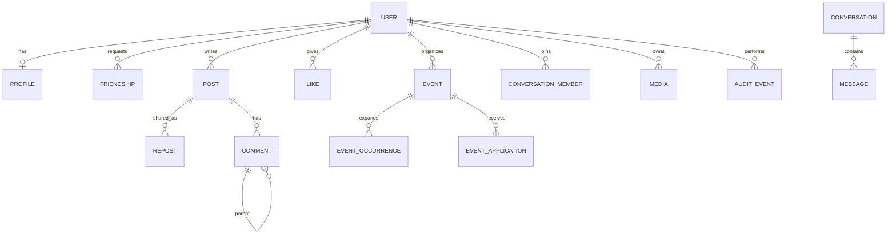

# Data model

| Field | Value |
| --- | --- |
| Status | Approved |
| Related | [../60-UML-diagrams/04-Class.md](../60-UML-diagrams/04-Class.md), [../40-Technical-specifications/07-Test-fixtures.md](../40-Technical-specifications/07-Test-fixtures.md) |

PostgreSQL is the system of record. Identifiers are UUIDs. Timestamps are UTC. Soft-delete (`deleted_at`) is used on member-visible content so moderation and nested threads stay consistent.

## Core entities

### `users`

| Column | Notes |
| --- | --- |
| `id` | UUID PK |
| `email` | Unique, CITEXT |
| `password_hash` | Argon2id |
| `handle` | Unique public identifier |
| `role` | `member` \| `moderator` \| `admin` |
| `status` | `active` \| `locked` \| `pending_verification` \| `closed` (Flyway V2 today omits `closed`; remaining work adds it) |
| `created_at` | |

### `profiles`

| Column | Notes |
| --- | --- |
| `user_id` | PK/FK |
| `display_name` | Flyway V2 has this only |
| `bio` | Remaining |
| `visibility` | `public` \| `private` (default `public`) |
| `sports` | `text[]` (weightlifting, running, …) |
| `experience_level` | `beginner` \| `intermediate` \| `advanced` |
| `city` | Free text |
| `lat`, `lng` | Optional, used by search and matching |
| `preferred_windows` | JSON list of weekday + time ranges |
| `avatar_media_id` | FK media, nullable |

Private profile: strangers see handle + avatar (or a placeholder) + “request to be friends”. Friends and staff see the full profile.

### `friendships`

| Column | Notes |
| --- | --- |
| `requester_id`, `addressee_id` | PK pair, ordered `requester ≠ addressee` |
| `status` | `pending` \| `accepted` \| `declined` \| `blocked` |
| `responded_at` | |

A check constraint stores the pair once (`requester_id < addressee_id` **or** always keep direction and unique the unordered pair via `LEAST/GREATEST`). Accepted friendships are the only ones that unlock friend-only resources.

### `posts`, `reposts`, `likes`

- `posts`: `author_id`, `body`, `visibility` (`friends` \| `public`), `created_at`, `edited_at`, `deleted_at`, `hidden_at`, `hidden_reason`
- `reposts`: (`user_id`, `post_id`) unique, `created_at`
- `likes`: (`user_id`, `target_type`, `target_id`) unique where `target_type ∈ {post, comment}`
- `post_media`: (`post_id`, `media_id`, `position`) max 4

### `comments`

- `post_id`, `author_id`, `parent_id` nullable, `body`, `depth`, `deleted_at`, `hidden_at`
- `depth` is denormalized (`parent.depth + 1`) and capped (see [../30-Functional-specifications/06-Nested-comments.md](../30-Functional-specifications/06-Nested-comments.md)).

### `events`, `event_occurrences`, `event_applications`

- `events`: organizer, title, description, `activity`, place, `lat/lng`, `starts_at`, `duration_min`, `visibility` (`public` \| `friends` \| `private`), `capacity`, `recurrence_rrule` nullable
- `event_occurrences`: materialized or computed instances for a window (needed for recurring sessions)
- `event_applications`: (`event_id` or `occurrence_id`, `user_id`, `status` pending/accepted/declined)

Private event: only friends of the organizer may apply. Public: any member. Capacity counts **accepted** applications + organizer.

### `conversations`, `conversation_members`, `messages`

- Direct conversations are unique for a pair of users.
- `messages`: `sender_id`, `type` (`text` \| `image` \| `audio`), `body`, `media_id`, `created_at`
- Messages are private: only members of the conversation.

### `media`

| Column | Notes |
| --- | --- |
| `id` | UUID |
| `owner_id` | |
| `bucket_key` | Object key, not a public URL |
| `kind` | `image` \| `audio` \| `avatar` |
| `mime`, `bytes` | |
| `visibility` | Inherited from parent (post, message, profile) |
| `status` | `pending` \| `ready` \| `rejected` |

Bytes live in MinIO. See [../40-Technical-specifications/04-Image-storage.md](../40-Technical-specifications/04-Image-storage.md).

### `reports`, `audit_events`

- `reports`: `id`, `reporter_id`, `target_type` (`user` \| `post` \| `comment` \| `event`), `target_id`, `reason`, `status` (`open` \| `resolved`), `created_at`
- `audit_events`: `id`, `actor_id`, `action`, `target_type`, `target_id`, `reason`, `at` — append-only

### `suggestion_scores` (cache)

Materialized `(user_id, candidate_id, score, primary_reason, computed_at)` so the request path does not walk the whole graph. Rebuilt asynchronously.

### `suggestion_dismissals`

`(viewer_id, candidate_id, until)` — FS-SUGG-04, 30 days.

### `matching_opt_ins`

`(user_id, week_start, created_at)` plus `matching_pairs` `(week_start, user_a, user_b, event_id nullable)` for FS-MATCH.

## Integrity highlights

- Cannot apply to your own event
- Cannot friend yourself
- Cannot like a deleted target
- File row is required before a message of type `image`/`audio` is visible
- Role changes are audit-logged

## Indexes (minimum)

- `posts (author_id, created_at desc)`
- `comments (post_id, parent_id)`
- `friendships` on both user columns + status
- `events (starts_at)` + GIST on `ll_to_earth(lat,lng)` or a simple box filter
- Full-text on `posts.body`, `events.title`, `profiles.display_name`
