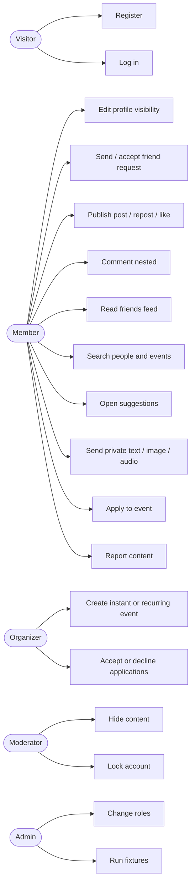

# Use case diagrams

| Field | Value |
| --- | --- |
| Status | Draft |
| Related | [../30-Functional-specifications](../30-Functional-specifications/README.md) |

## Actors and goals

Organizer is a **role on an event**, not a distinct account type (include relationship with Member).

## Primary use case — find a gym buddy

| | |
| --- | --- |
| Actor | Member |
| Precondition | Authenticated, profile completed |
| Main success | Member searches / uses suggestions → sends friend request → accepted → creates or applies to a session → trains |
| Extensions | Decline, block, event full, private profile stub |

## Primary use case — friends-only session (brief example)

| | |
| --- | --- |
| Actor | Organizer (member) |
| Precondition | Has at least one friend if visibility is `friends` |
| Main success | Create event (place, duration, time, capacity, friends-only) → friends apply → organizer accepts until full |
| Extensions | Recurring weekly; cancel occurrence; withdraw |
