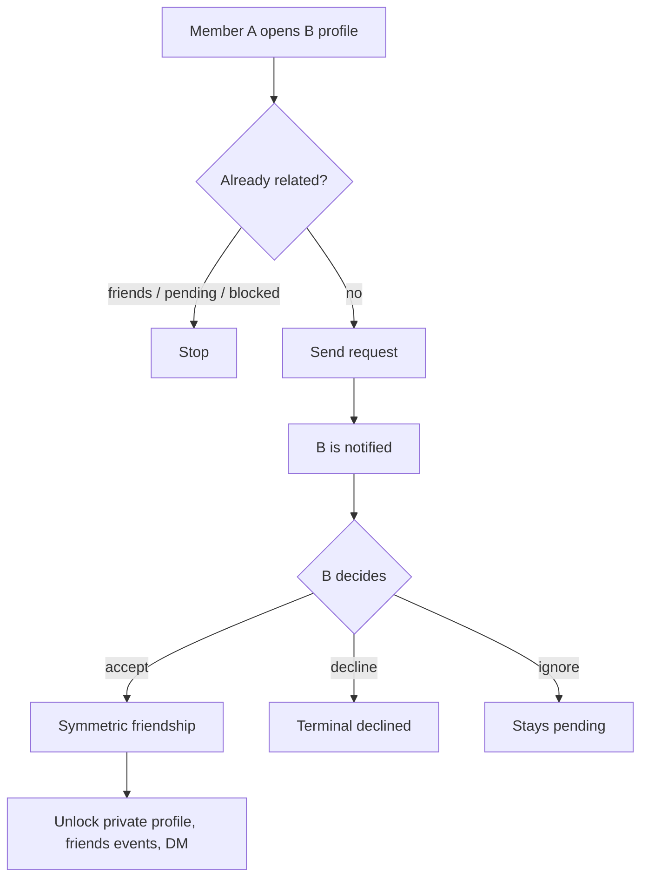
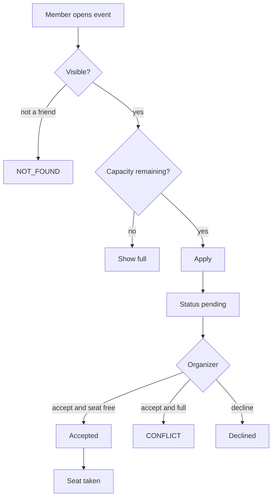
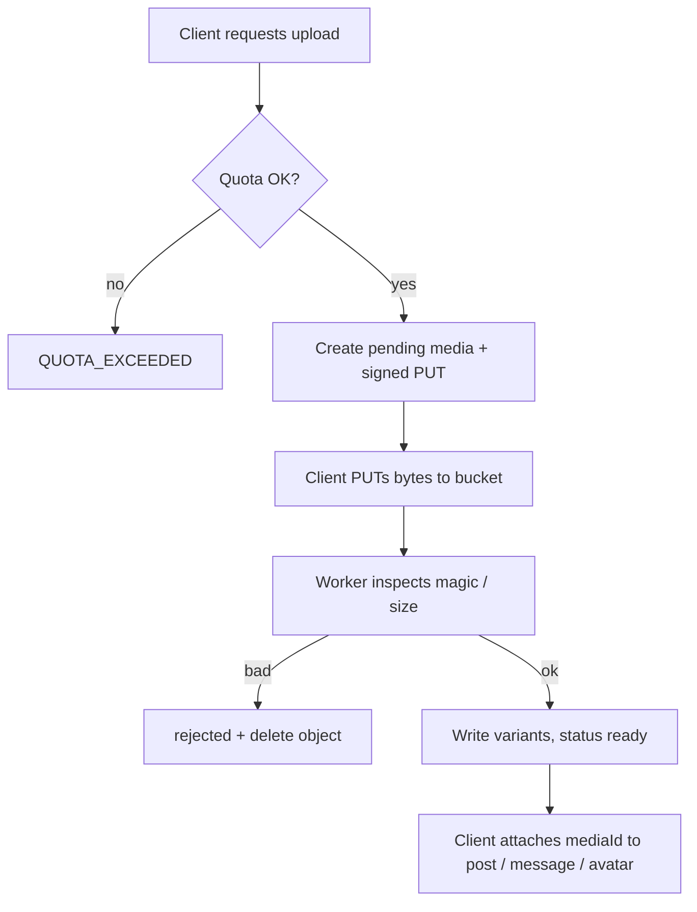

# Activity diagrams

| Field | Value |
| --- | --- |
| Status | Draft |

## Friend request

```mermaid
flowchart TD
  A[Member A opens B profile] --> B{Already related?}
  B -->|friends / pending / blocked| Z[Stop]
  B -->|no| C[Send request]
  C --> D[B is notified]
  D --> E{B decides}
  E -->|accept| F[Symmetric friendship]
  E -->|decline| G[Terminal declined]
  E -->|ignore| H[Stays pending]
  F --> I[Unlock private profile, friends events, DM]
```

## Apply to a friends-only event

```mermaid
flowchart TD
  S[Member opens event] --> V{Visible?}
  V -->|not a friend| X[NOT_FOUND]
  V -->|yes| C{Capacity remaining?}
  C -->|no| F[Show full]
  C -->|yes| A[Apply]
  A --> P[Status pending]
  P --> O{Organizer}
  O -->|accept and seat free| OK[Accepted]
  O -->|accept and full| CF[CONFLICT]
  O -->|decline| NO[Declined]
  OK --> T[Seat taken]
```

## Media upload

```mermaid
flowchart TD
  R[Client requests upload] --> Q{Quota OK?}
  Q -->|no| E[QUOTA_EXCEEDED]
  Q -->|yes| M[Create pending media + signed PUT]
  M --> U[Client PUTs bytes to bucket]
  U --> W[Worker inspects magic / size]
  W -->|bad| RJ[rejected + delete object]
  W -->|ok| V[Write variants, status ready]
  V --> ATT[Client attaches mediaId to post / message / avatar]
```
