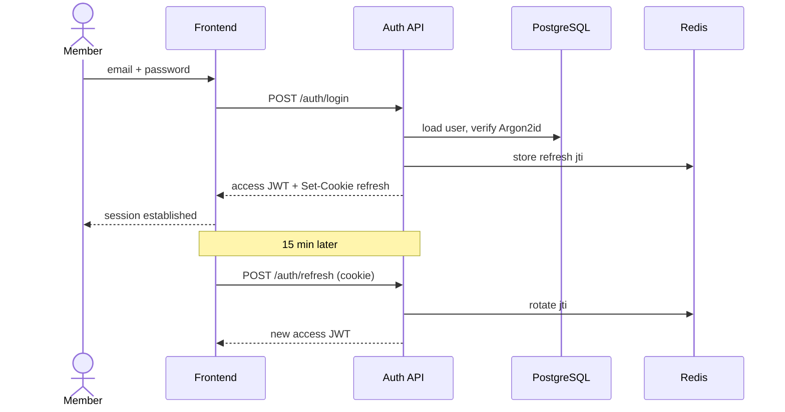
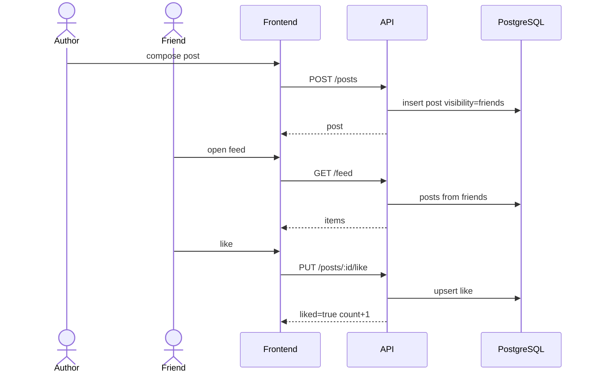
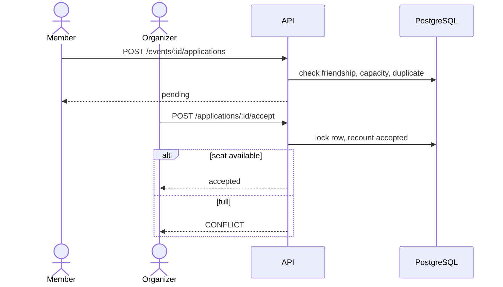
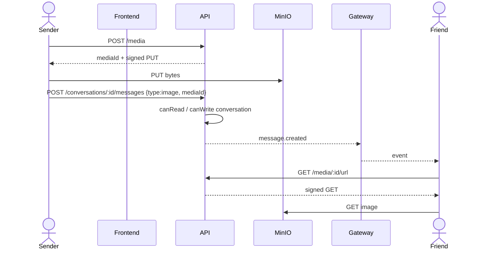

# Sequence diagrams

| Field | Value |
| --- | --- |
| Status | Draft |

## Login and refresh

```mermaid
sequenceDiagram
  actor U as Member
  participant FE as Frontend
  participant API as Auth API
  participant DB as PostgreSQL
  participant RD as Redis

  U->>FE: email + password
  FE->>API: POST /auth/login
  API->>DB: load user, verify Argon2id
  API->>RD: store refresh jti
  API-->>FE: access JWT + Set-Cookie refresh
  FE-->>U: session established

  Note over FE,API: 15 min later
  FE->>API: POST /auth/refresh (cookie)
  API->>RD: rotate jti
  API-->>FE: new access JWT
```

## Create post and like

```mermaid
sequenceDiagram
  actor A as Author
  actor B as Friend
  participant FE as Frontend
  participant API as API
  participant DB as PostgreSQL

  A->>FE: compose post
  FE->>API: POST /posts
  API->>DB: insert post visibility=friends
  API-->>FE: post

  B->>FE: open feed
  FE->>API: GET /feed
  API->>DB: posts from friends
  API-->>FE: items
  B->>FE: like
  FE->>API: PUT /posts/:id/like
  API->>DB: upsert like
  API-->>FE: liked=true count+1
```

## Apply to event

```mermaid
sequenceDiagram
  actor M as Member
  actor O as Organizer
  participant API as API
  participant DB as PostgreSQL

  M->>API: POST /events/:id/applications
  API->>DB: check friendship, capacity, duplicate
  API-->>M: pending

  O->>API: POST /applications/:id/accept
  API->>DB: lock row, recount accepted
  alt seat available
    API-->>O: accepted
  else full
    API-->>O: CONFLICT
  end
```

## Send private image

```mermaid
sequenceDiagram
  actor A as Sender
  participant FE as Frontend
  participant API as API
  participant S3 as MinIO
  participant WS as Gateway
  actor B as Friend

  A->>API: POST /media
  API-->>A: mediaId + signed PUT
  A->>S3: PUT bytes
  A->>API: POST /conversations/:id/messages {type:image, mediaId}
  API->>API: canRead / canWrite conversation
  API-->>WS: message.created
  WS-->>B: event
  B->>API: GET /media/:id/url
  API-->>B: signed GET
  B->>S3: GET image
```
