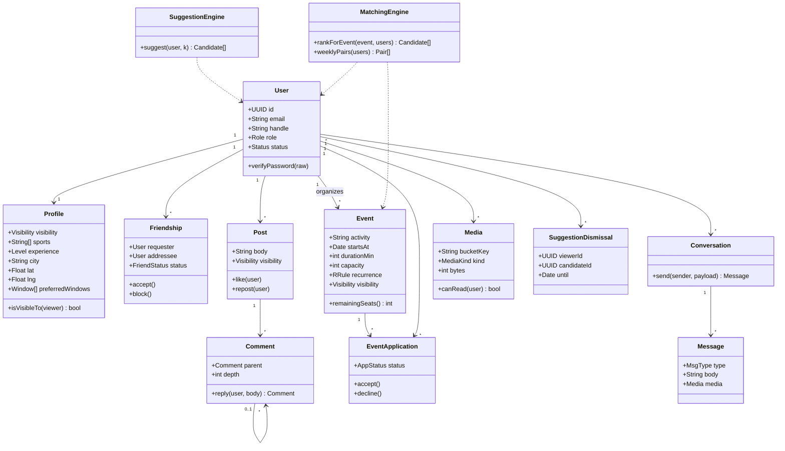

# Class diagram

| Field | Value |
| --- | --- |
| Status | Approved |
| Related | [../20-Architecture/06-Data-model.md](../20-Architecture/06-Data-model.md) |

Domain types (not ORM annotations). Align fields with the data model when either changes.

Enums: `Role`, `Status`, `Visibility`, `FriendStatus`, `AppStatus`, `MsgType`, `MediaKind`, `Level`.
