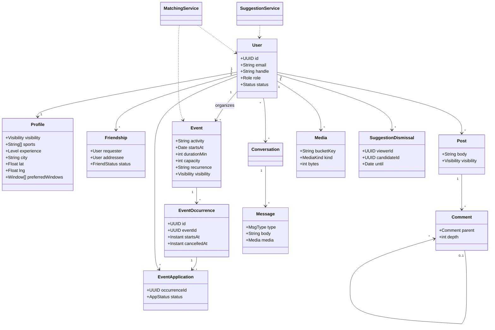

# Class diagram

| Field | Value |
| --- | --- |
| Status | Approved |
| Related | [../20-Architecture/06-Data-model.md](../20-Architecture/06-Data-model.md) |

Conceptual view of the implemented records and services. Selected fields are simplified for readability; this is not an exhaustive Java API listing. Business operations live in services, rather than invented record methods.

Enums: `Role`, `Status`, `Visibility`, `FriendStatus`, `AppStatus`, `MsgType`, `MediaKind`, `Level`.
