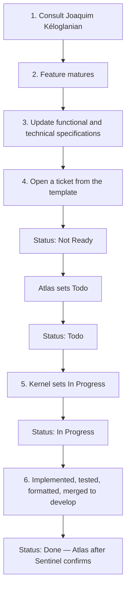

# Feature implementation workflow

| Field | Value |
| --- | --- |
| Status | Approved |
| Related | [05-Tickets-and-GitHub-projects.md](05-Tickets-and-GitHub-projects.md), [03-Review-process.md](03-Review-process.md), [02-Git-workflow.md](02-Git-workflow.md), [07-CI-CD.md](07-CI-CD.md), [../30-Functional-specifications/00-Conventions.md](../30-Functional-specifications/00-Conventions.md) |

How a feature goes from an idea in the assignment (or a later request) to a merge on `develop`. This page is the process. Ticket fields live in [05-Tickets-and-GitHub-projects.md](05-Tickets-and-GitHub-projects.md). Git and CI rules stay on their own pages.

The product owner is **Joaquim Kéloglanian**. He owns consult and scope (step 1). He is not the merge/board gate.

**Who moves the board:**

- **Atlas alone** sets `Not Ready` → `Todo`.
- **Kernel** sets `Todo` → `In Progress` when they start the ticket (after creating or linking the branch from the issue Development panel). Do not leave a card in `Todo` while Kernel is implementing.
- **Atlas** sets `In Progress` → `Done` only after **Sentinel** confirms the work was implemented and satisfies the gym-buddy-documentation functional requirements.

Atlas does not invent other status transitions. Sentinel does not move the board. Joaquim is not the merge/board gate.

## Sequence

### 1. Consult Joaquim Kéloglanian

The first step is always a conversation with Joaquim. Scope, what “done” looks like, and which wiki pages will own the feature are decided here — not invented in a ticket.

Do not open a ticket in this step. Do not start a `feature/*` branch.

### 2. Let the feature mature

Keep talking until the feature is concrete enough to write as requirements: actors, rules, errors, and what a test would assert. If it is still a sketch, stay here.

### 3. Update the specifications

Once the feature has matured, **write or update the wiki first**:

| Kind of change | Where it lands |
| --- | --- |
| What the product does | [30-Functional-specifications](../30-Functional-specifications/README.md) (`FS-…` requirements) |
| How it is built | [40-Technical-specifications](../40-Technical-specifications/README.md) (`TS-…` when they exist) |
| Algorithm to justify | [50-Algorithms](../50-Algorithms/README.md) |
| Shape of the system | [20-Architecture](../20-Architecture/README.md) |
| HTTP surface | [40-Technical-specifications/08-OpenAPI-contract.md](../40-Technical-specifications/08-OpenAPI-contract.md) — the YAML itself stays in `gym-buddy-openapi` |

A ticket that points at a missing or stale spec is invalid. Change the spec in this repository, then open the ticket.

### 4. Create the ticket

Open a GitHub Issue on **`gym-buddy-documentation`** using the existing template [`.github/ISSUE_TEMPLATE/ticket.yml`](../../.github/ISSUE_TEMPLATE/ticket.yml). Fill **every** field. An empty optional-looking box is not optional here.

The form **automatically adds the issue to [Gym Buddy Project](https://github.com/orgs/Projet-de-compensation-2025-2026/projects/1)** (`projects: Projet-de-compensation-2025-2026/1`). That is required, not optional. Confirm the checkbox. Do not remove the issue from the board afterwards.

The form also requires **`70-Engineering-practices`**. That directory is the org-wide source of truth for code style, Gitflow / Conventional Commits, pull requests, tickets, versioning, and CI/CD. Every implementation in every repository follows it. Agents do not invent a parallel workflow.

If you create an issue without the form, attach it to the project **and** cite `70-Engineering-practices` in the same step. An issue that exists only in the repo issues list is not a ticket yet.

| Template field | What to put |
| --- | --- |
| Title | `[GB] ` plus one imperative outcome |
| Type | Feature, Bug, Chore, or Docs |
| Documentation page | Relative path(s) of the **feature** spec in **this** wiki. Required. Example: `30-Functional-specifications/07-Events.md`. Add the matching technical page when one exists. |
| Engineering practices | Always `70-Engineering-practices`. Required. |
| Spec IDs | `FS-…` / `TS-…` from those pages |
| Implementation repository | Every repo that will change (`gym-buddy-documentation`, `gym-buddy-service`, `gym-buddy-ui`, `gym-buddy-openapi`) |
| Acceptance | Checklist copied or cited from the linked spec |
| Gym Buddy Project | Required checkbox. The form already attaches the issue. |
| Follow engineering practices | Required checkbox. |

The ticket **must** point at the documentation it implements. A title such as “implement events” with no wiki path is incomplete — go back to step 3.

The ticket **must** be on **Gym Buddy Project**. Do not create a second project.

Newly created tickets default to **`Not Ready`**.

## Statuses

There are exactly four. They are the Status field on **Gym Buddy Project**. Do not invent extra columns (`Backlog`, `Ready`, `In review`, …).

Atlas alone sets `Not Ready` → `Todo`. Kernel sets `Todo` → `In Progress` when they start the ticket. Atlas sets `In Progress` → `Done` only after Sentinel confirms the work was implemented and satisfies the gym-buddy-documentation functional requirements. Atlas does not invent other status transitions. Sentinel does not move the board.

Create each implementation branch from the issue’s **Development → Create a branch** action, or link the PR/branch there afterwards.

| Status | Meaning | Who may set it |
| --- | --- | --- |
| `Not Ready` | Ticket exists, every template field is filled, it is on **Gym Buddy Project**, and it points at wiki pages. It is **not** approved for implementation. | Default at creation |
| `Todo` | The ticket and linked specs are complete enough to implement | Atlas alone (`Not Ready` → `Todo`) |
| `In Progress` | Implementation of this ticket has started (branch created or linked from the Development panel) | Kernel (`Todo` → `In Progress`), **as soon as** work starts |
| `Done` | The change is implemented, tested, formatted, and **merged into `develop`** | Atlas (`In Progress` → `Done`), only after Sentinel confirms |

### `Not Ready` → `Todo`

Atlas alone sets `Not Ready` → `Todo`. Atlas (the non-coding ops agent) does this when the ticket and linked specs are complete enough to implement. Joaquim is not the merge/board gate.

Sentinel does not move the board and does not gate this move: nothing is implemented yet. A verbal “looks fine, go” in the consult (step 1) is not this board change; that consult happens *before* the specs and the ticket exist.

### `Todo` → `In Progress`

Kernel sets `Todo` → `In Progress` when they start the ticket, after creating or linking the branch from the issue’s **Development** panel. Do not leave a card in `Todo` while Kernel is implementing.

Create each implementation branch from the issue’s **Development → Create a branch** action, or link the PR/branch there afterwards. That is how GitHub records the association and how the project item shows the branch. The ticket form cannot create or auto-link a future branch. Several branches or PRs can be linked to one ticket.

Implementation still follows [02-Git-workflow.md](02-Git-workflow.md): branch from `develop`, PR back to `develop`, commit scope `(#<id>)`, `Refs: Projet-de-compensation-2025-2026/gym-buddy-documentation#<id>`.

### `In Progress` → `Done`

A ticket becomes `Done` when **all** of these are true:

1. The behaviour in the linked spec is implemented
2. Tests required by that spec (and [80-Testing](../80-Testing/README.md)) exist and pass
3. Format is applied in CI (`format.sh --write` — [07-CI-CD.md](07-CI-CD.md)); the tree must be clean after the bot commit and after the merge
4. The PR is merged into **`develop`**

Atlas sets `In Progress` → `Done` only after Sentinel (the tests/review agent) confirms the work was implemented and satisfies the gym-buddy-documentation functional requirements. Sentinel does not move the board. Joaquim is not the merge/board gate.

A green CI run on an open PR is not `Done`. A squash onto `main` (a Release) is not what closes the ticket. Tickets close on `develop`; Release packages whatever is already there.

## What this page does not replace

- Ticket field rules: [05-Tickets-and-GitHub-projects.md](05-Tickets-and-GitHub-projects.md)
- Branch names and commit messages: [02-Git-workflow.md](02-Git-workflow.md)
- PR checklist: [03-Review-process.md](03-Review-process.md)
- How `develop` is proven and how `main` is tagged: [07-CI-CD.md](07-CI-CD.md)
